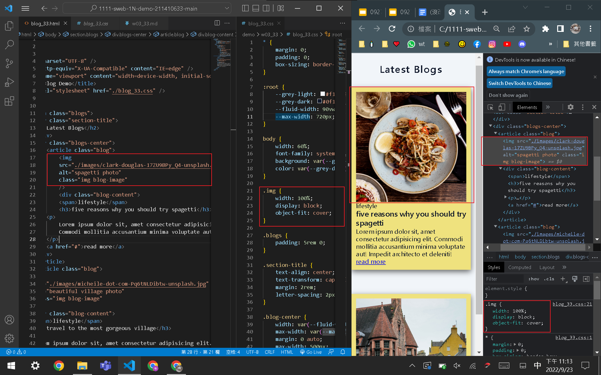
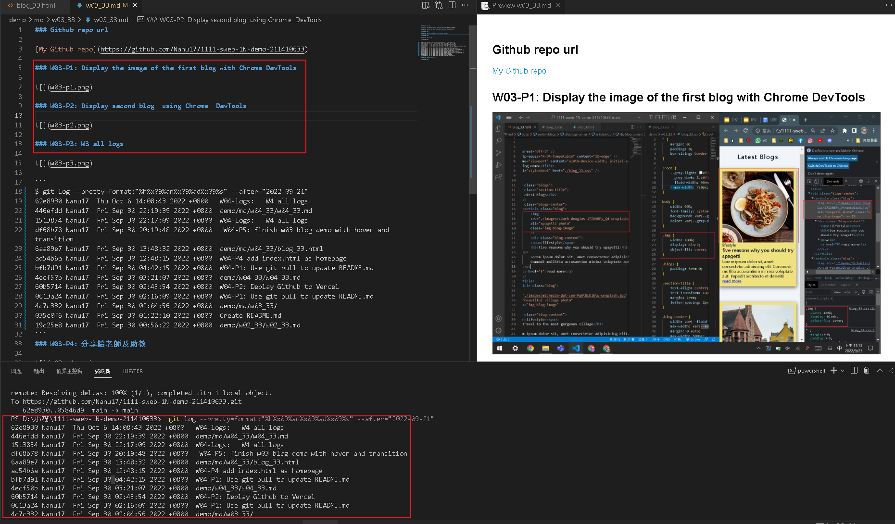

### Github repo url

[My Github repo](https://github.com/Nanu17/1111-sweb-1N-demo-211410633)

### W03-P1: Display the image of the first blog with Chrome DevTools



### W03-P2: Display second blog  using Chrome  DevTools 


### W03-P3: W3 all logs



```
$ git log --pretty=format:"%h%x09%an%x09%ad%x09%s" --after="2022-09-21" 
62e8930 Nanu17  Thu Oct 6 14:08:43 2022 +0800   W04-logs:   W4 all logs
446efdd Nanu17  Fri Sep 30 22:19:39 2022 +0800  demo/md/w04_33/w04_33.md
1513854 Nanu17  Fri Sep 30 22:17:09 2022 +0800  W04-logs:   W4 all logs
df68b78 Nanu17  Fri Sep 30 20:19:48 2022 +0800   W04-P5: finish w03 blog demo with hover and transition
6aa89e7 Nanu17  Fri Sep 30 13:48:32 2022 +0800  demo/md/w04_33/blog_33.html
ad54b6a Nanu17  Fri Sep 30 12:48:15 2022 +0800  W04-P4 add index.html as homepage
bfb7d91 Nanu17  Fri Sep 30 04:42:15 2022 +0800  W04-P1: Use git pull to update README.md
4ecf50b Nanu17  Fri Sep 30 03:21:07 2022 +0800  demo/w04_33/w04_33.md
60b5714 Nanu17  Fri Sep 30 02:45:54 2022 +0800  W04-P2: Deplay Github to Vercel
0613a24 Nanu17  Fri Sep 30 02:16:09 2022 +0800  W04-P1: Use git pull to update README.md
4c7c332 Nanu17  Fri Sep 30 02:04:56 2022 +0800  demo/md/w03_33/
035c0f6 Nanu17  Fri Sep 30 01:22:10 2022 +0800  Create README.md
19c25e8 Nanu17  Fri Sep 30 00:56:22 2022 +0800  demo/w02_33/w02_33.md
```
### W03-P4: 分享給老師及助教

