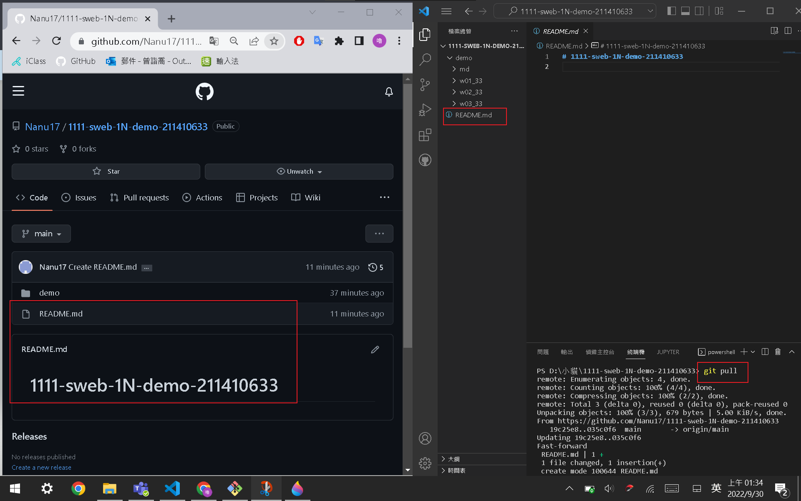
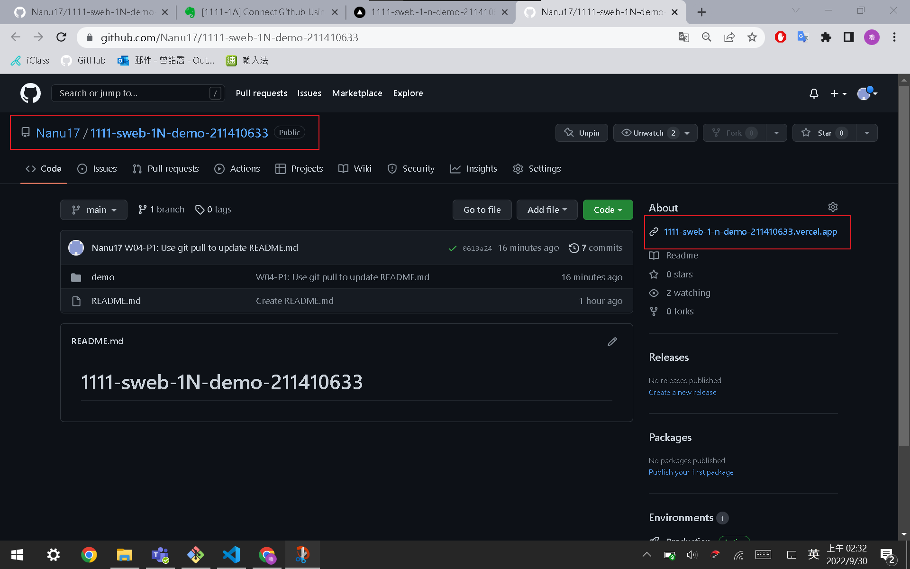
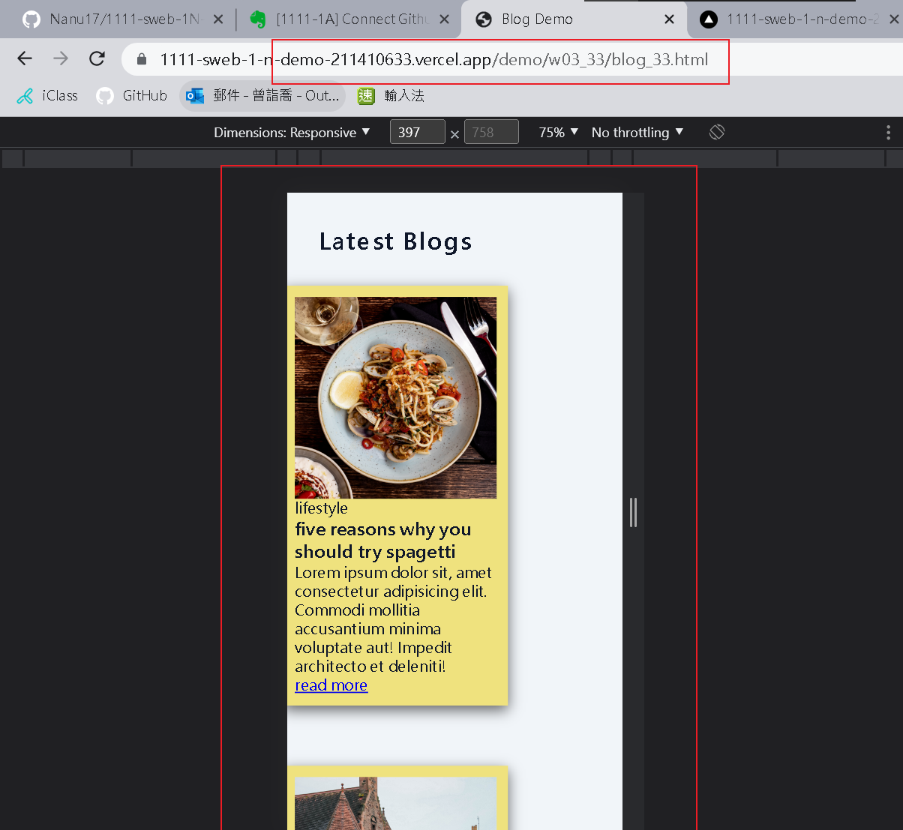
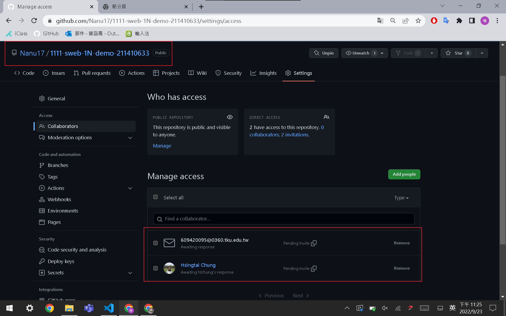
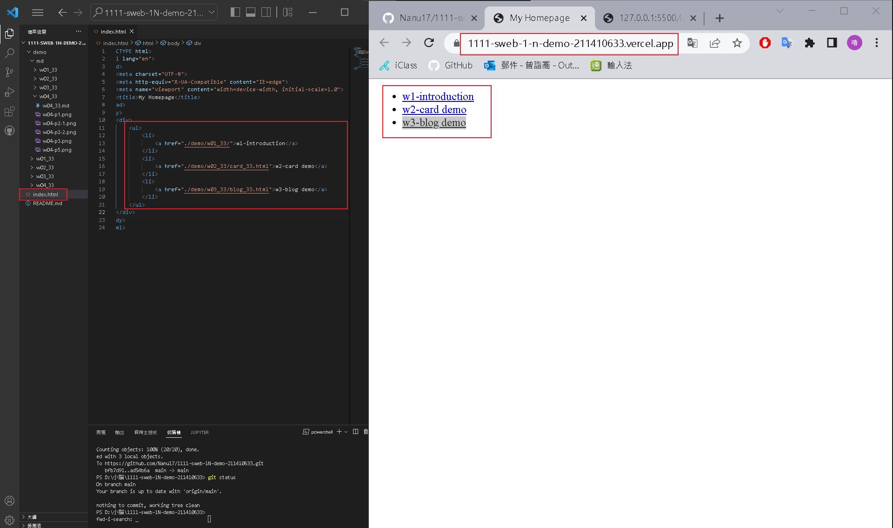
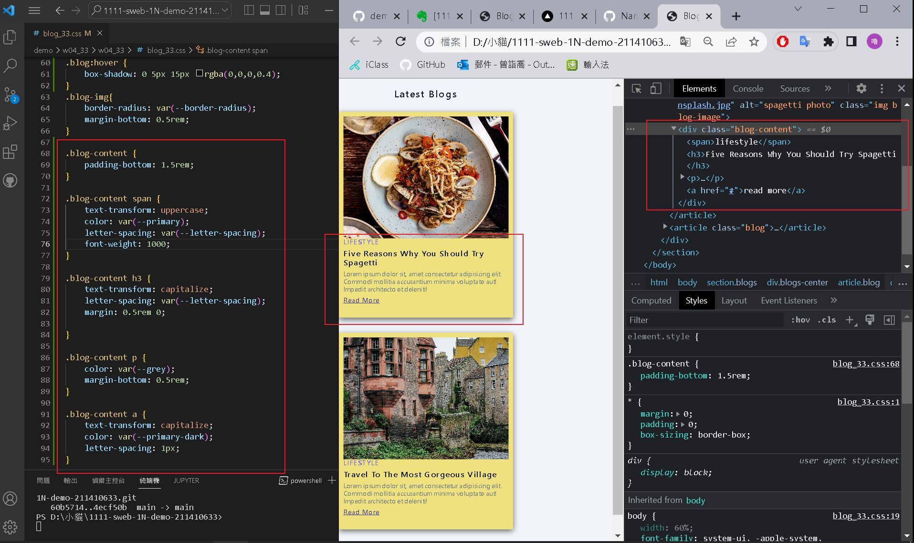
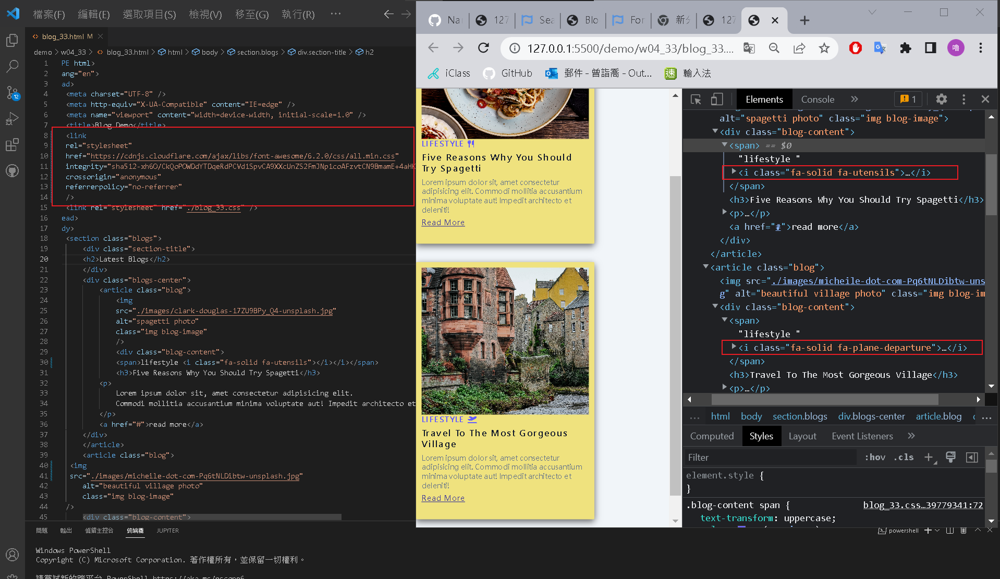
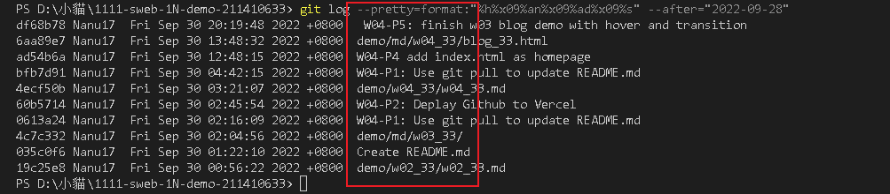

### Github repo url

[My Github repo](https://github.com/Nanu17/1111-sweb-1N-demo-211410633)

### W04-P1: Use git pull to update README.md



### W04-P2: Deplay Github to Vercel






### W04-P3: Share Github repo to teacher and TA



### W04-P4: add index.html as homepage, and show in vercel



### W04-P5: finish w03 blog demo with hover and transition



### W04-P6: add font awesome css, add two icons



### W04-logs:   W4 all logs



```
$ git log--


```