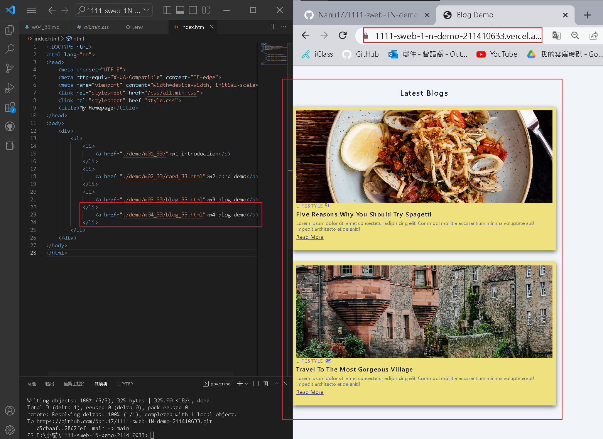
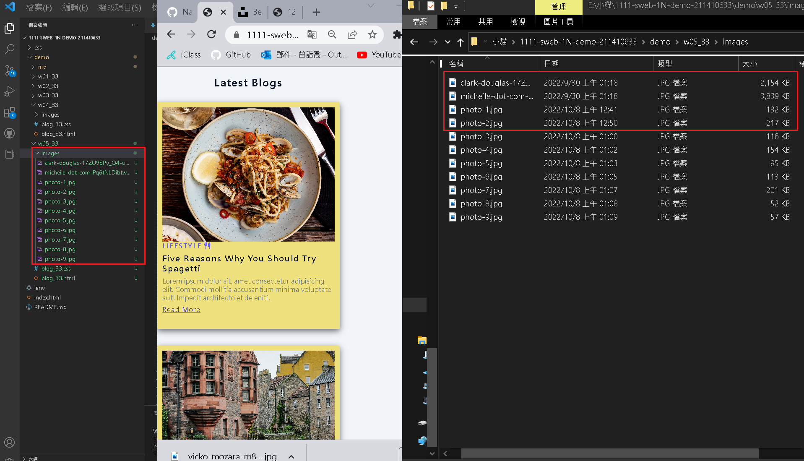
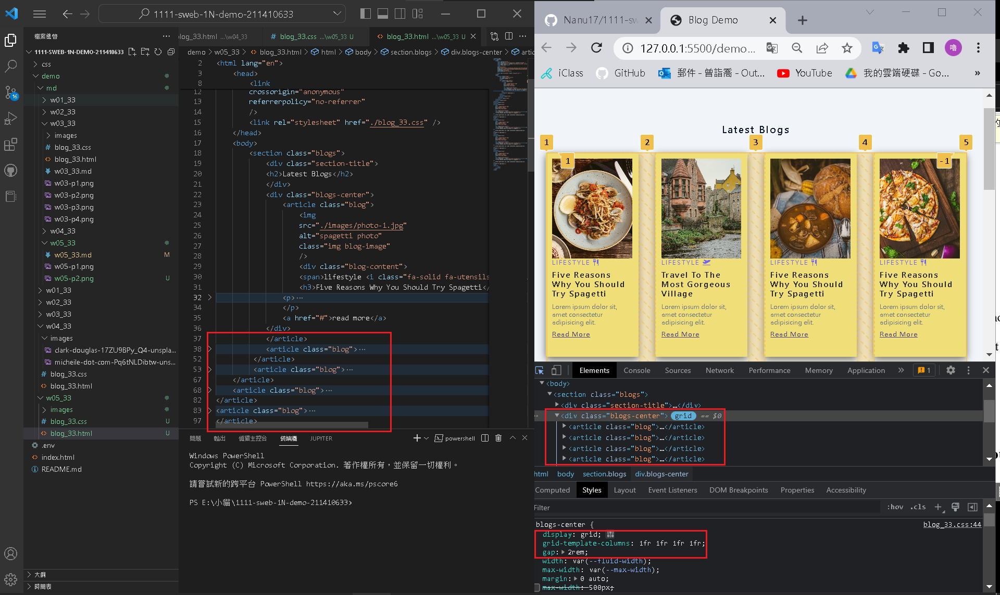
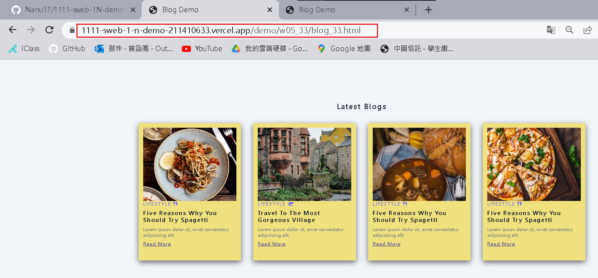
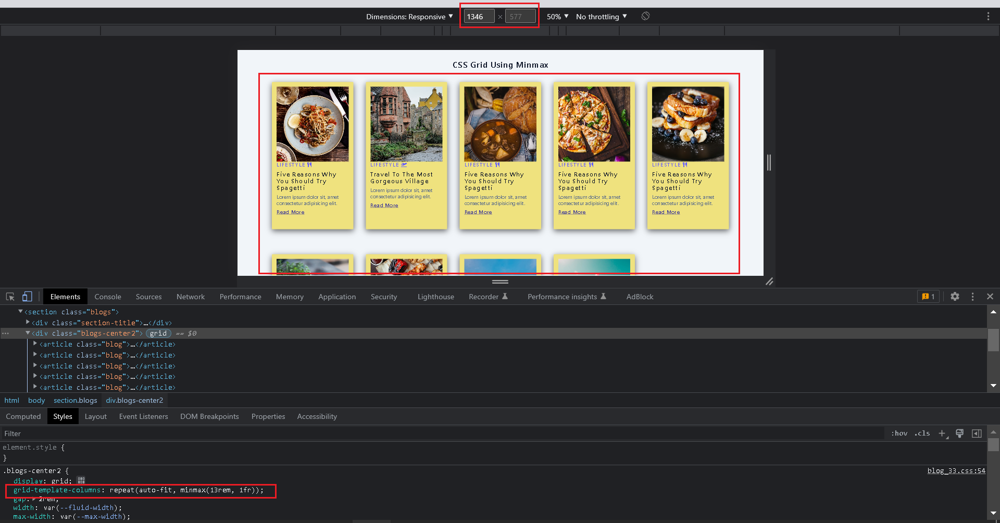
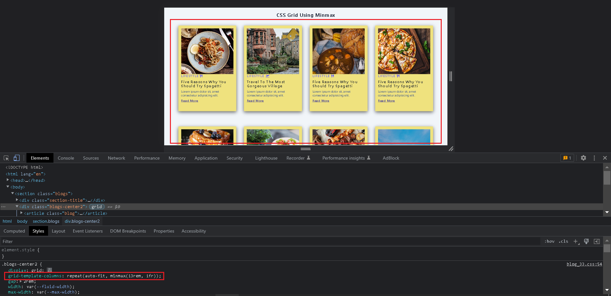
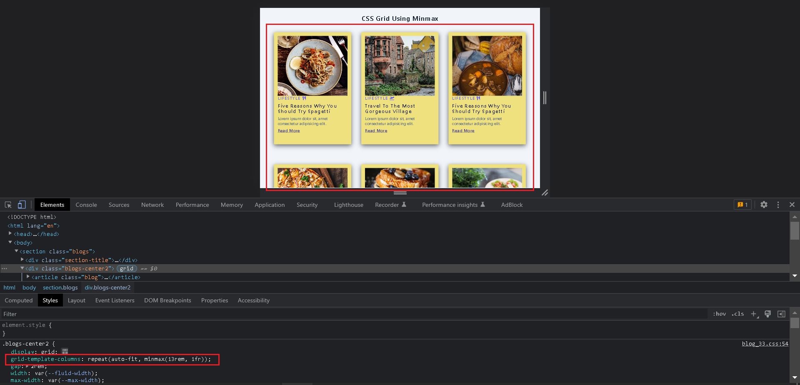
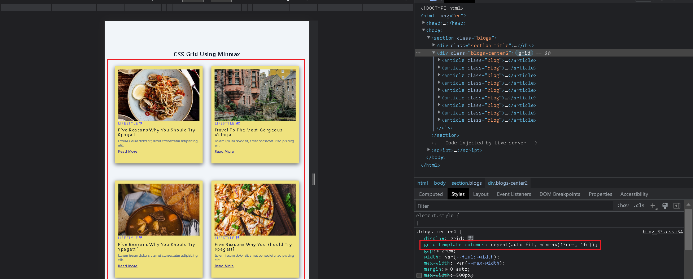
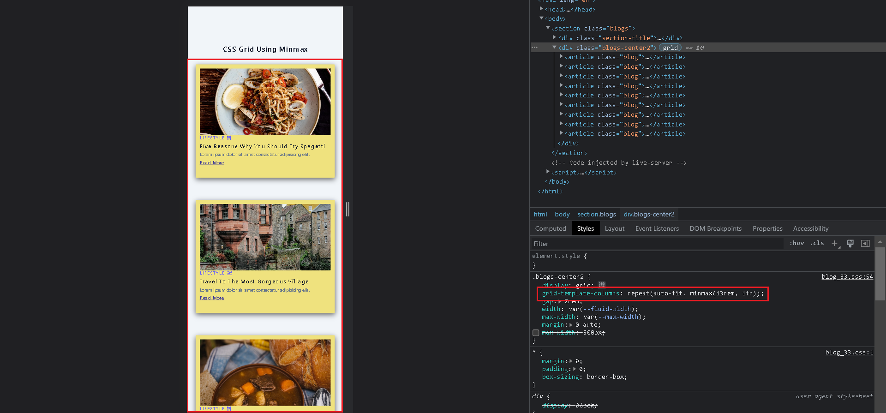
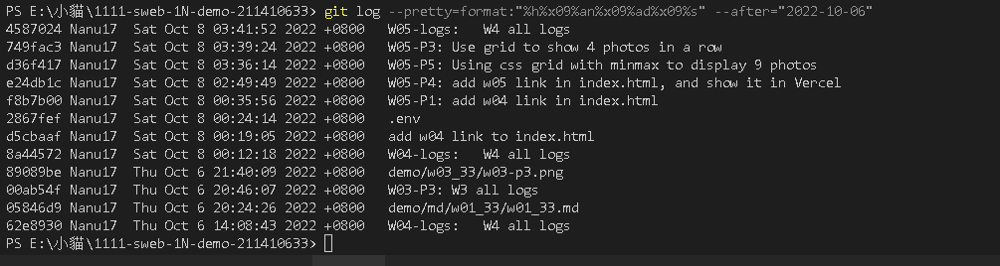

### Github repo url

[My Github repo](https://github.com/Nanu17/1111-sweb-1N-demo-211410633)

### W05-P1: add w04 link in index.html



### W05-P2: get 9 photos using small sizes



### W05-P3: Use grid to show 4 photos in a row



### W05-P4: add w05 link in index.html, and show it in Vercel



### W05-P5: Using css grid with minmax to display 9 photos










### W05-logs:   W4 all logs



```
$ git log --pretty=format:"%h%x09%an%x09%ad%x09%s" --after="2022-10-06"
4587024 Nanu17  Sat Oct 8 03:41:52 2022 +0800   W05-logs:   W4 all logs
749fac3 Nanu17  Sat Oct 8 03:39:24 2022 +0800   W05-P3: Use grid to show 4 photos in a row
d36f417 Nanu17  Sat Oct 8 03:36:14 2022 +0800   W05-P5: Using css grid with minmax to display 9 photos
e24db1c Nanu17  Sat Oct 8 02:49:49 2022 +0800   W05-P4: add w05 link in index.html, and show it in Vercel
f8b7b00 Nanu17  Sat Oct 8 00:35:56 2022 +0800   W05-P1: add w04 link in index.html
2867fef Nanu17  Sat Oct 8 00:24:14 2022 +0800   .env
d5cbaaf Nanu17  Sat Oct 8 00:19:05 2022 +0800   add w04 link to index.html
8a44572 Nanu17  Sat Oct 8 00:12:18 2022 +0800   W04-logs:   W4 all logs
89089be Nanu17  Thu Oct 6 21:40:09 2022 +0800   demo/w03_33/w03-p3.png
00ab54f Nanu17  Thu Oct 6 20:46:07 2022 +0800   W03-P3: W3 all logs
05846d9 Nanu17  Thu Oct 6 20:24:26 2022 +0800   demo/md/w01_33/w01_33.md
62e8930 Nanu17  Thu Oct 6 14:08:43 2022 +0800   W04-logs:   W4 all logs

```