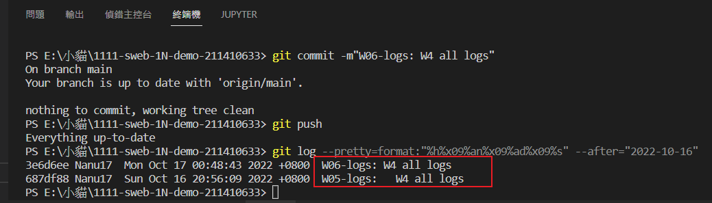

### Github repo url

[My Github repo](https://github.com/Nanu17/1111-sweb-1N-demo-211410633)

### W06-P1: add 3 breakpoints for different devices


### W06-P2: add navbar for demo links


### W06-P3: run 4 classdemo one by one


### W06-logs: W4 all logs



```
$ git log --pretty=format:"%h%x09%an%x09%ad%x09%s" --after="2022-10-16"

3e6d6ee Nanu17  Mon Oct 17 00:48:43 2022 +0800  W06-logs: W4 all logs
687df88 Nanu17  Sun Oct 16 20:56:09 2022 +0800  W05-logs:   W4 all logs

```