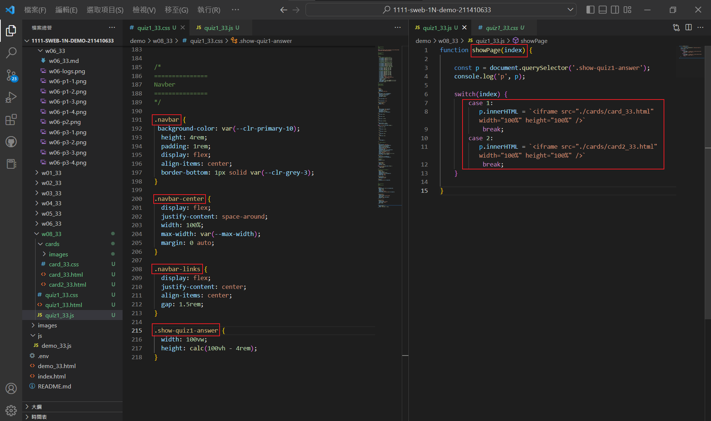
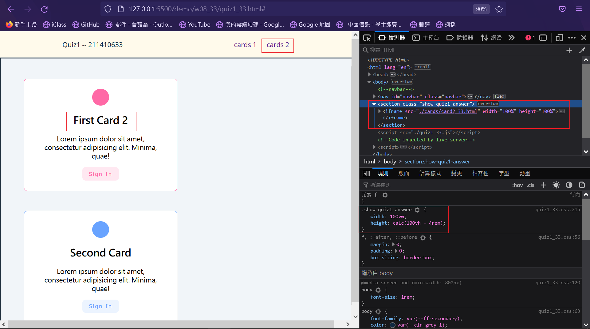
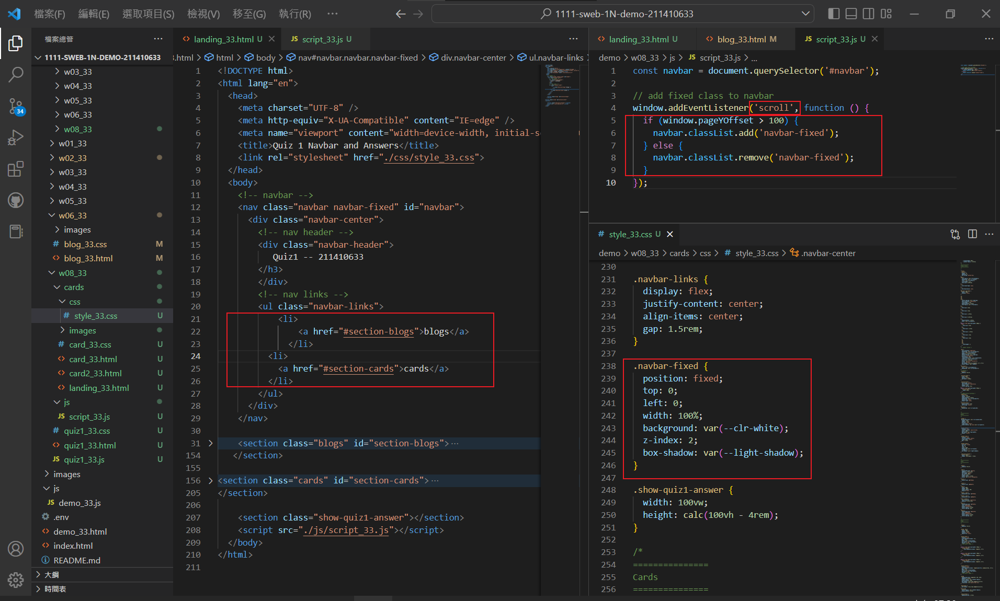
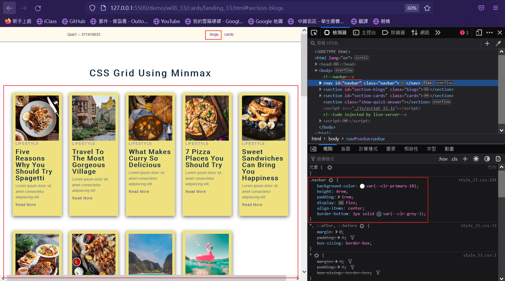
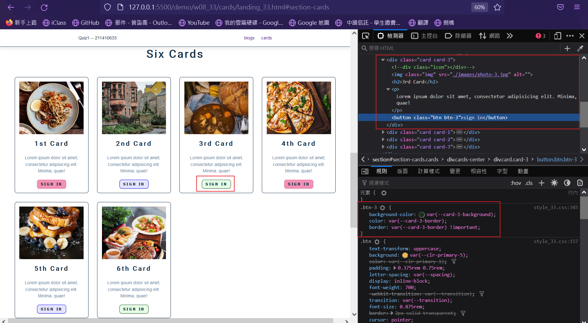
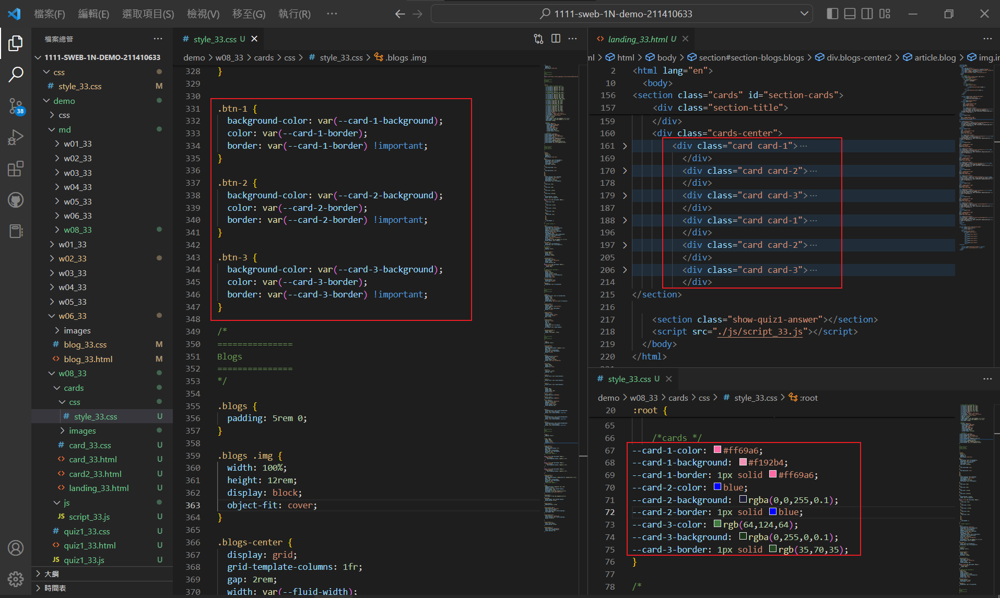
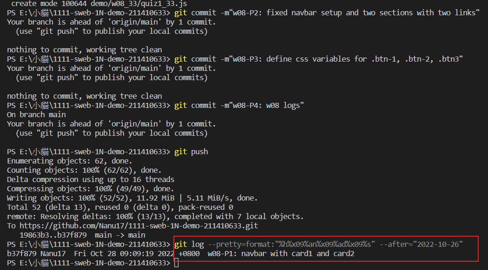

### Github repo url

[My Github repo](https://github.com/Nanu17/1111-sweb-1N-demo-211410633)

### w08-P1: navbar with card1 and card2







### w08-P2: fixed navbar setup and two sections with two links






### w08-P3: define css variables for .btn-1, .btn-2, .btn3





### w08-P4: w08 logs



```
$ git log --pretty=format:"%h%x09%an%x09%ad%x09%s" --after="2022-10-26"
b37f879 Nanu17  Fri Oct 28 09:09:19 2022 +0800  w08-P1: navbar with card1 and card2
```