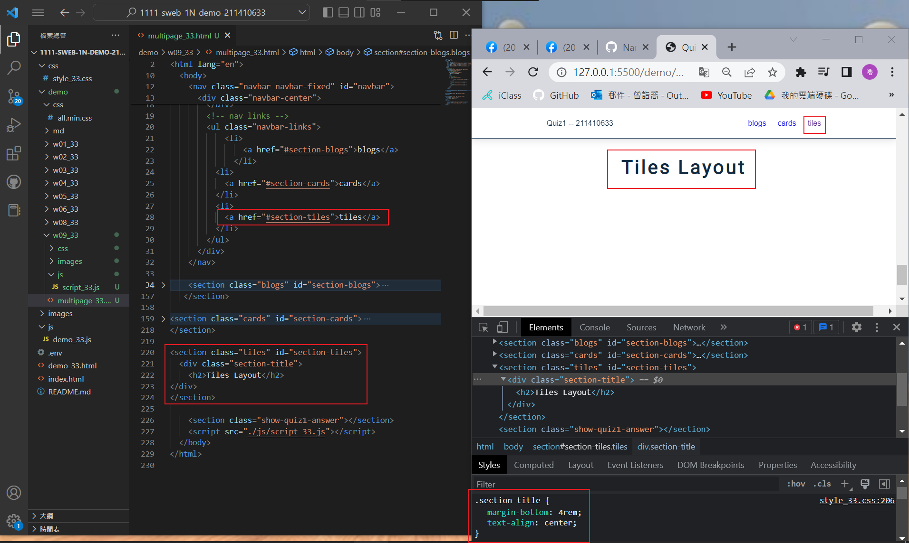
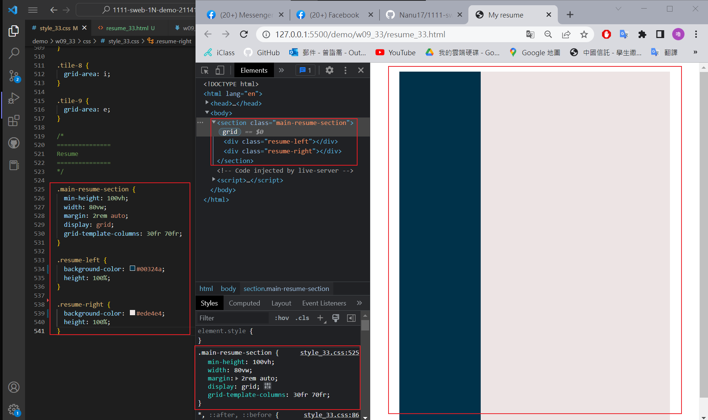

### Github & Vercel URL

[Github URL](https://github.com/Nanu17/1111-sweb-1N-demo-211410633)
[Vercel URL](https://1111-sweb-1-n-demo-211410633.vercel.app/)

### w09-P1: setup tiles menu item with section id



### w09-P2: Show tiles layout of 9 photos


### w09-P3: Resume, show resume-left and resume-right with ratio 30:70



### w09-P4: Resume, show .profile with photo, name, career


### w09-P5: Resume, show about info on resume-right section


### w09-logs: w09 logs

```
$ git log --pretty=format:"%h%x09%an%x09%ad%x09%s" --after="2022-11-02"
faed86e Nanu17  Fri Nov 4 14:04:01 2022 +0800   w09-P5: Resume, show about info on resume-right section
8e53f3a Nanu17  Fri Nov 4 13:07:08 2022 +0800   demo/md/w09_33/w09_33.md
22dfd33 Nanu17  Fri Nov 4 13:04:12 2022 +0800   ### w09-P1: setup tiles menu item with section id
40563f7 Nanu17  Fri Nov 4 11:40:21 2022 +0800   demo/md/w08_33/w08_33.md
```